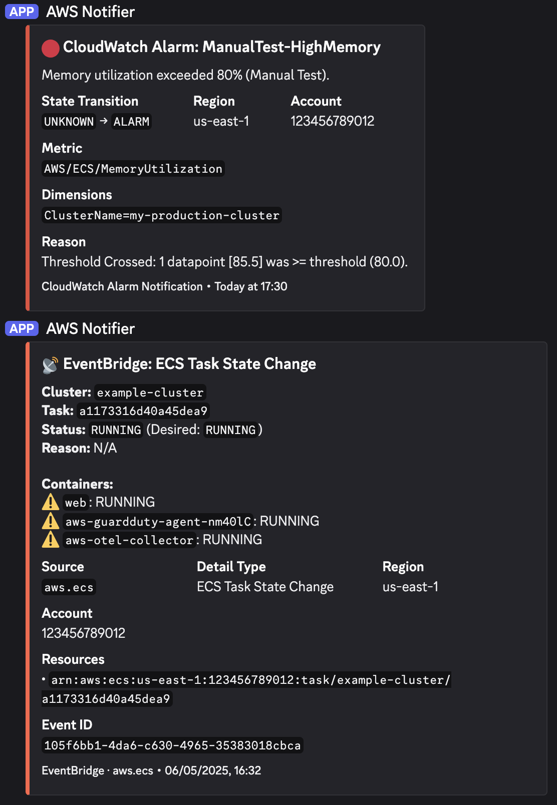

# AWS → Discord Notifier (Lambda)

A zero-dependency Python 3.12 AWS Lambda function that forwards **CloudWatch Alarm** notifications (via SNS) and **EventBridge** events to a **Discord** channel using webhooks.

> **⚠️ Disclaimer**: This repository was generated by an AI assistant. While it includes comprehensive tests and follows best practices, it has **not yet been tested in a production environment**. Please review and validate the code before deploying to critical systems.

---

## Architecture


```
┌──────────────────┐       ┌───────────┐       ┌──────────────────┐       ┌─────────┐
│ CloudWatch Alarm │──────▶│ SNS Topic │──────▶│                  │──────▶│         │
│ (e.g. LambdaErr) │       └───────────┘       │  Lambda Function │       │ Discord │
└──────────────────┘                           │  (this project)  │       │ Channel │
┌──────────────────┐                           │                  │       │         │
│  EventBridge     │──────────────────────────▶│                  │──────▶│         │
│  Rule (ECS Stop) │                           └──────────────────┘       └─────────┘
└──────────────────┘
```

## Features

|Feature|Details|
|---|---|
| **Self-Monitoring** | Includes a built-in CloudWatch Alarm that notifies you if the Lambda function itself errors |
| **CloudWatch Alarms** | Colour-coded embeds (🔴 ALARM, 🟢 OK, 🟡 INSUFFICIENT_DATA) with metric, dimensions, and threshold details |
| **EventBridge Events** | Supports any EventBridge event; defaults to **ECS Task Stopped** and **ECS Service Action** notifications |
| **Plain-text SNS** | Falls back gracefully if the SNS message isn't JSON |
| **Zero dependencies** | Uses only the Python standard library (`urllib`, `json`, `dataclasses`) |
| **SAM template** | One-command deploy via AWS SAM |

## Preview



---

## Project Structure

```
.
├── lambda_discord_notifier/
│   ├── handler.py          # Lambda entry-point
│   ├── parsers/            # Event parsers (CloudWatch, ECS, etc.)
│   └── discord_client.py   # Webhook client (stdlib only)
├── tests/
│   └── test_handler.py     # Unit tests
├── template.yaml           # AWS SAM template
└── README.md
```

---

## Prerequisites

1. **Python 3.12+**
2. **AWS SAM CLI** – [Install guide](https://docs.aws.amazon.com/serverless-application-model/latest/developerguide/install-sam-cli.html)
3. **Discord webhook URL** – Server Settings → Integrations → Webhooks → New Webhook → Copy URL

---

## Quick Start

### 1. Clone & test locally

```bash
# Run unit tests
python -m pytest tests/ -v

# Or with unittest
python -m unittest discover -s tests -v
```

### 2. Deploy with SAM

```bash
# Build
sam build

# Deploy (guided – first time)
sam deploy --guided
```

During guided deploy you will be prompted for:

| Parameter | Description |
|---|---|
| `DiscordWebhookUrl` | Your Discord webhook URL |
| `AlarmTopicName` | SNS topic name (default: `CloudWatchAlarmsToDiscord`) |
| `EventBridgeRulePrefix` | Prefix for EventBridge rules (default: `DiscordNotifier-`) |

### 3. Point CloudWatch Alarms to the SNS topic

```bash
aws cloudwatch put-metric-alarm \
  --alarm-name "HighMemory" \
  --metric-name MemoryUtilization \
  --namespace AWS/ECS \
  --statistic Average \
  --period 300 \
  --threshold 80 \
  --comparison-operator GreaterThanOrEqualToThreshold \
  --evaluation-periods 1 \
  --alarm-actions arn:aws:sns:<REGION>:<ACCOUNT_ID>:CloudWatchAlarmsToDiscord \
  --dimensions Name=ClusterName,Value=my-production-cluster
```

### 4. Customise the EventBridge rule

Edit the `Pattern` in `template.yaml` to match the events you care about:

```yaml
# Example: GuardDuty findings
Pattern:
  source:
    - "GuardDuty Finding"
```

```yaml
# Example: EC2 Instance State-change
Pattern:
  source:
    - aws.ec2
  detail-type:
    - "EC2 Instance State-change Notification"
```

```yaml
# Example: any ECS task state change
Pattern:
  source:
    - aws.ecs
  detail-type:
    - "ECS Task State Change"
```

---

## Environment Variables

| Variable | Required | Default | Description |
|---|---|---|---|
| `DISCORD_WEBHOOK_URL` | ✅ | — | Full Discord webhook URL |
| `LOG_LEVEL` | ❌ | `INFO` | Python log level (`DEBUG`, `INFO`, `WARNING`, `ERROR`) |

---

## Manual Setup (No SAM)
If you prefer not to use AWS SAM:

1. **Zip the code**:
   ```bash
   cd lambda_discord_notifier
   zip -r ../deployment.zip .
   cd ..
   ```

2. **Create Lambda**:
   - Create a Python 3.12 Lambda function.
   - Upload `deployment.zip`.
   - Set Handler to `handler.lambda_handler`.

3. **Configure Environment**:
   - Add `DISCORD_WEBHOOK_URL` environment variable.

4. **Triggers**:
   - **SNS**: Create an SNS Topic (e.g., `CloudWatchAlarms`) and add it as a trigger.
   - **EventBridge**: Create Rules for `ECS Task State Change` or `ECS Service Action` and set the Lambda as the target.


---

## Testing

```bash
# Run all tests
python -m pytest tests/ -v

# Run with coverage
python -m pytest tests/ --cov=lambda_discord_notifier --cov-report=term-missing
```

---

## Local Invocation with SAM

```bash
# Invoke with an SNS test event
sam local invoke DiscordNotifierFunction \
  --event tests/events/sns_cloudwatch_alarm.json \
  --env-vars env.json

# env.json
{
  "DiscordNotifierFunction": {
    "DISCORD_WEBHOOK_URL": "https://discord.com/api/webhooks/YOUR_ID/YOUR_TOKEN"
  }
}
```

---

## License

MIT
